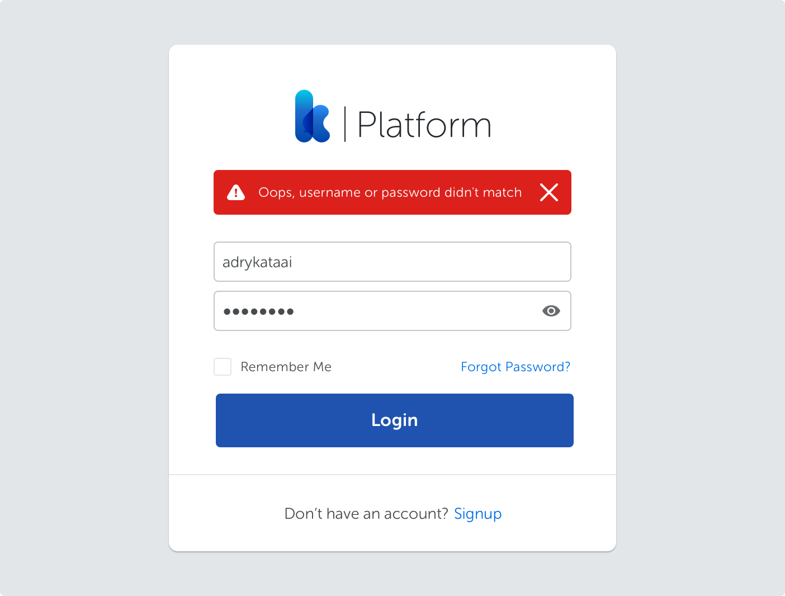
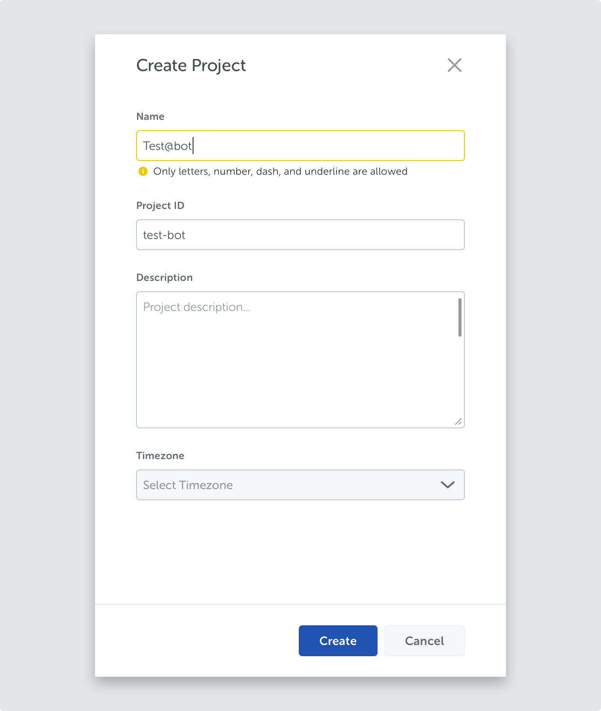
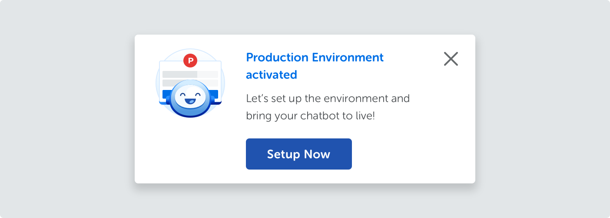
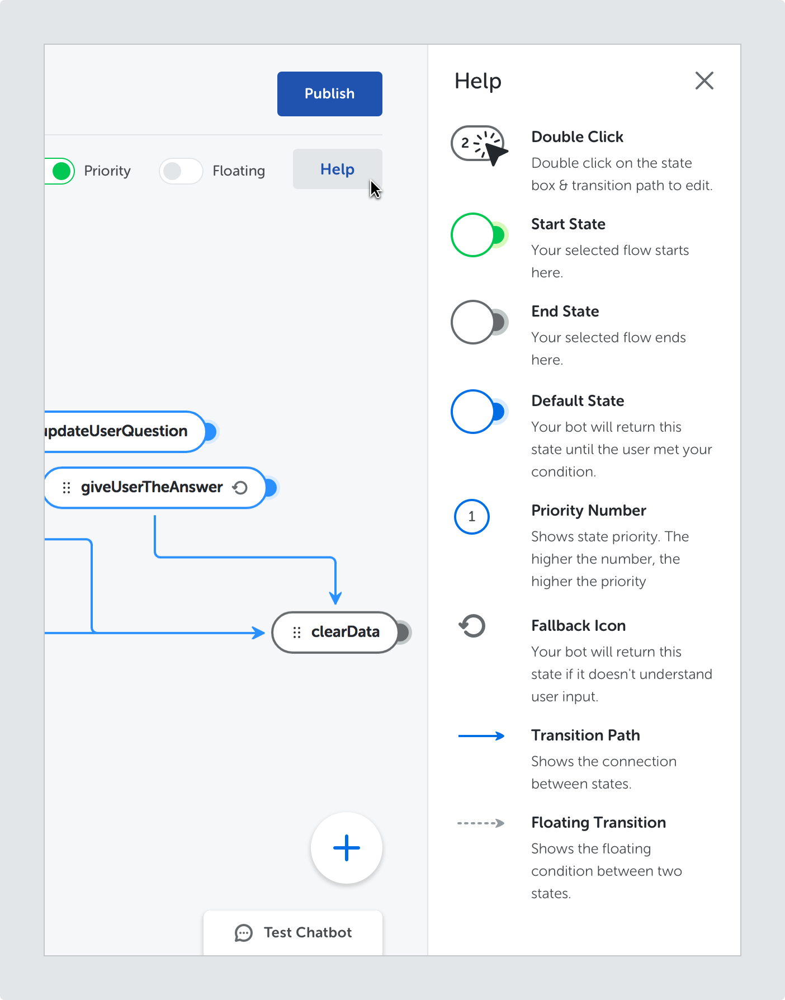
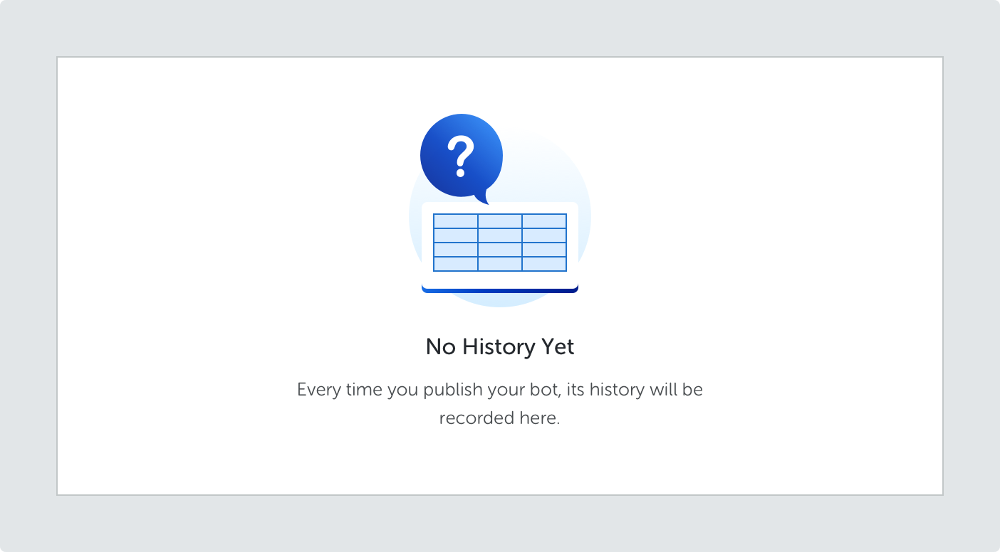
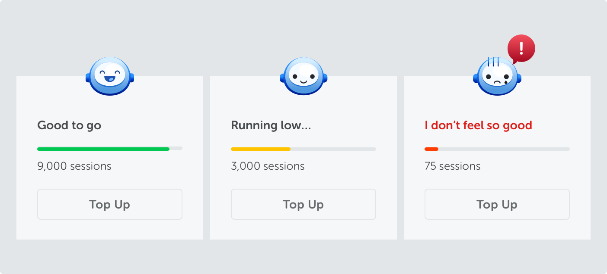

This guideline is our approach to shape and maintain the way we communicate our product. Considering we have a few business units within the company, this particular guideline was made as a reference for **Kata Platform**.

## Writing Goals

On **Kata Platform**, our content aims to:

<md-row class="principle">
<md-col md="3" class="principle-image">

</md-col>
<md-col class="principle-content">

#### Educate

We want people to learn and apply new concepts and information quickly. Make sure you're able to explain a topic in the simplest terms. When possible, use a simple analogy to help them understand better.

</md-col>
</md-row>

<md-row class="principle">
<md-col md="3" class="principle-image">

</md-col>
<md-col class="principle-content">

#### Be Inclusive

Respect people regardless of their skill levels. If something went south, tell them what happened, but do it without talking down to them. Remember that every successful project has to start somewhere.

</md-col>
</md-row>

<md-row class="principle">
<md-col md="3" class="principle-image">

</md-col>
<md-col class="principle-content">

#### Be Conversational

Though it makes sense to speak in a technical manner, developers are human, too. Talk to them as if you’re working with them. Have fun once in a while; work doesn’t have to be dull all the time.

</md-col>
</md-row>

## Writing Principles

We feel like the basic writing principles invented by the giants (Google’s principle is our main inspiration) have become the industry standard to a point where it’s simply impossible to build great products without it. We stick to those principles by default.

Here are some of the best practices that we adopt:

### Straightforward

- Cut to the chase and tell people what’s happening and why.
- Translate technical terms into action that people can perform.
- If you feel like you need to explain what you just wrote, rewrite.

#### Example

### Helpful

- Don’t just tell the reason why something happens. Provide the next step, and never leave the users hanging.
- Write messages that anticipate people’s needs.

#### Example

### Appropriate

- Feel free to use humor, puns, or pop-culture reference whenever you feel appropriate. However, use it in moderation.
- Make sure what you write is still inline to your brand’s core values.

#### Example

