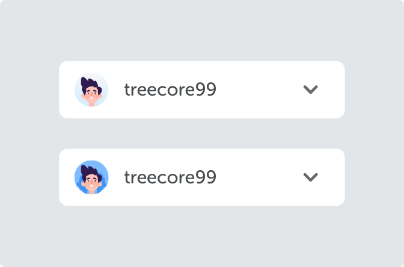
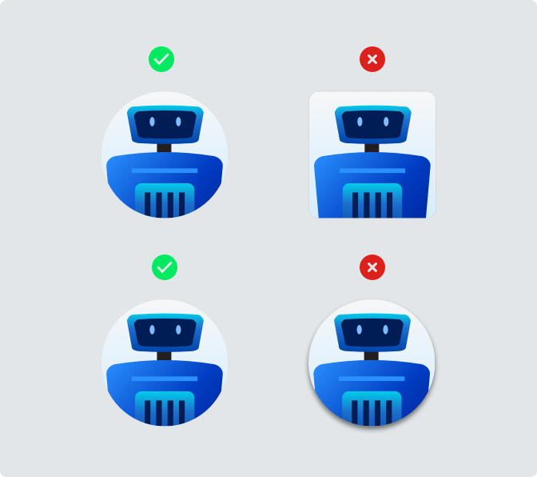
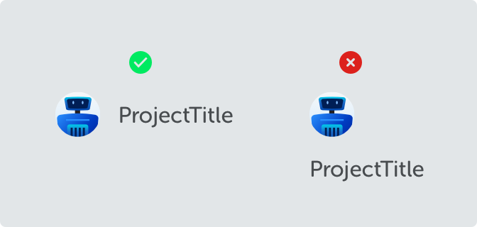

<text-primary>

Avatars are used to show a thumbnail representation of an individual or project in the interface.

</text-primary>

## Style

Avatars are available in 2 sizes. The avatar which shown as card header (40px x 40px), and the avatar for user or team avatar (24px x 24px).

<md-row breakpoint="lg" justify="centered">
<md-col sm="6">

</md-col>
</md-row>

### Project Avatar

Avatar on project card indicates project thumbnail, it shows randomize robot on the different project.

### User Avatar

When avatars indicate a user, avatars will show randomize individual character.

### User Team Avatar

When avatars indicate a group of users (or called a team), avatars will show randomize the group of users characters.

## Best Practices

### On Project Card

<md-row class="component-guide">
<md-col class="component-guide-image">

</md-col>
<md-col class="component-guide-content">

<guideline-table title="Do">
  <guideline-ul>
    <guideline-li guide="do">Use Robot avatar type on every project card</guideline-li>
    <guideline-li guide="do">Use size 40x40</guideline-li>
  </guideline-ul>
</guideline-table>

<guideline-table title="Don't">
  <guideline-ul>
    <guideline-li guide="dont">Don't use a static robot, make it dynamically change</guideline-li>
    <guideline-li guide="dont">Don't use user or group of user avatar type</guideline-li>
  </guideline-ul>
</guideline-table>

</md-col>
</md-row>

### On Account Select

<md-row class="component-guide">
<md-col class="component-guide-image">

</md-col>
<md-col class="component-guide-content">

<guideline-table title="Do">
  <guideline-ul>
    <guideline-li guide="do">Use user or group of user avatar type</guideline-li>
    <guideline-li guide="do">Use size 24x24</guideline-li>
  </guideline-ul>
</guideline-table>

<guideline-table title="Don't">
  <guideline-ul>
    <guideline-li guide="dont">Don't use robot avatar</guideline-li>
  </guideline-ul>
</guideline-table>

</md-col>
</md-row>

### On Account Select (List Item)

<md-row class="component-guide">
<md-col class="component-guide-image">

</md-col>
<md-col class="component-guide-content">

<guideline-table title="Do">
  <guideline-ul>
    <guideline-li guide="do">Put avatar on item list right next to the account name so as to distinguish from one another</guideline-li>
    <guideline-li guide="do">Use size 24x24</guideline-li>
  </guideline-ul>
</guideline-table>

<guideline-table title="Don't">
  <guideline-ul>
    <guideline-li guide="dont">Don't use robot avatar</guideline-li>
  </guideline-ul>
</guideline-table>

</md-col>
</md-row>

### As UI Object

<md-row class="component-guide">
<md-col class="component-guide-image">

</md-col>
<md-col class="component-guide-content">

<guideline-table title="Do">
  <guideline-ul>
    <guideline-li guide="do">Use round avatars to quickly identify</guideline-li>
  </guideline-ul>
</guideline-table>

<guideline-table title="Don't">
  <guideline-ul>
    <guideline-li guide="dont">Don't use round square</guideline-li>
    <guideline-li guide="dont">Don't add shadow or border into the avatar (or both, that's worse)</guideline-li>
  </guideline-ul>
</guideline-table>

</md-col>
</md-row>

<md-row class="component-guide">
<md-col class="component-guide-image">

</md-col>
<md-col class="component-guide-content">

<guideline-table title="Do">
  <guideline-ul>
    <guideline-li guide="do">Inline with another element</guideline-li>
  </guideline-ul>
</guideline-table>

<guideline-table title="Don't">
  <guideline-ul>
    <guideline-li guide="dont">Don't put at top of the other element</guideline-li>
  </guideline-ul>
</guideline-table>

</md-col>
</md-row>
