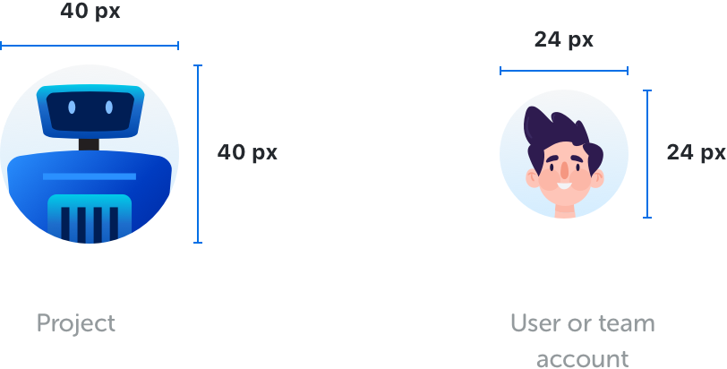
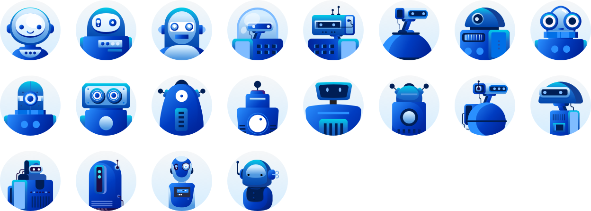
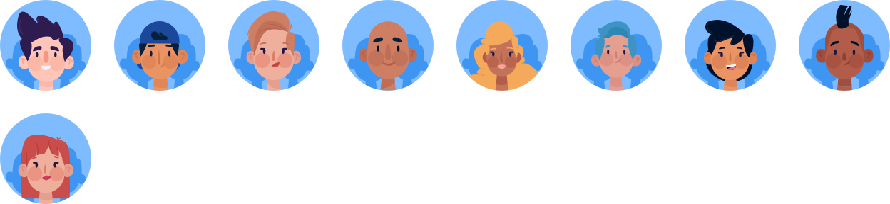

<text-primary>

Avatars are used to show a thumbnail representation of an individual or project in the interface.

</text-primary>

## Style

Avatars are available in 2 sizes. The avatar which shown as card header (40px x 40px), and the avatar for user or team avatar (24px x 24px).

<md-row breakpoint="lg" justify="centered">
<md-col sm="6">

</md-col>
</md-row>

### Project Avatar

Avatar on project card indicates project thumbnail, it shows randomize robot on the different project.

### User Avatar

When avatars indicate a user, avatars will show randomize individual character.

### User Team Avatar

When avatars indicate a group of users (or called a team), avatars will show randomize the group of users characters.

## Best Practices

[TODO: best practices component?]
