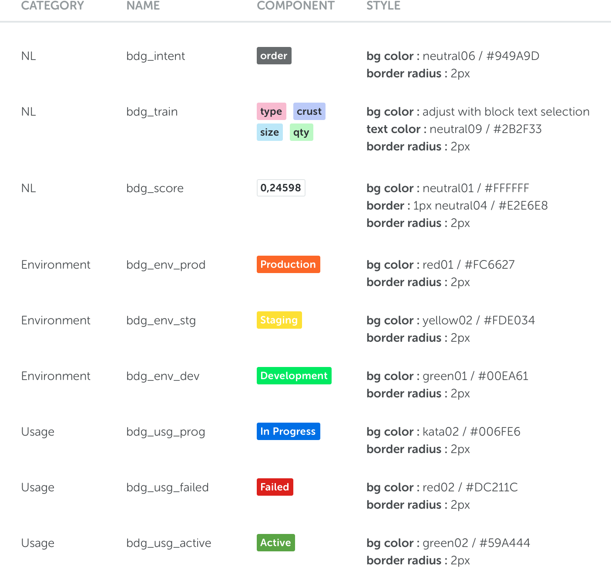

<text-primary>

Badges are used for elements that need to be labeled or categorized. It consists of a keyword that helps to draw attention.

</text-primary>

## Style

The badge in Kata Platform is distinguished by category of what features is in used and it has different styles.

## Anatomy

The badge in Kata Platform is distinguished by category of what features is in used and it has different styles.

1. Text badge
2. Container

## Specs

## Best Practices

[TODO: best practices component?]
