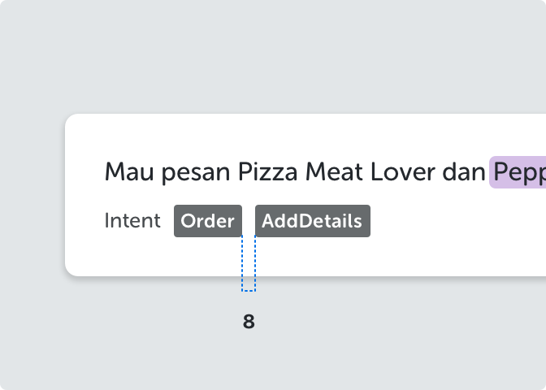
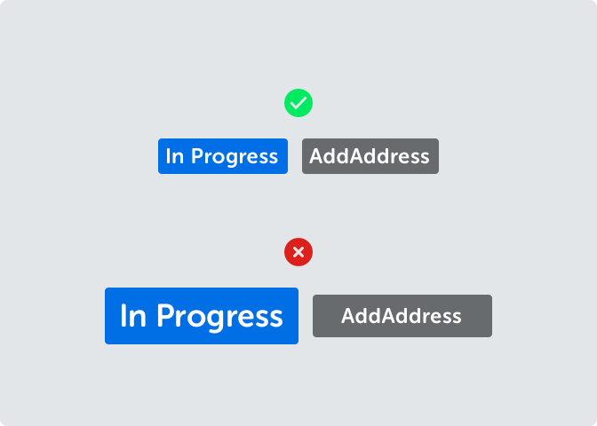
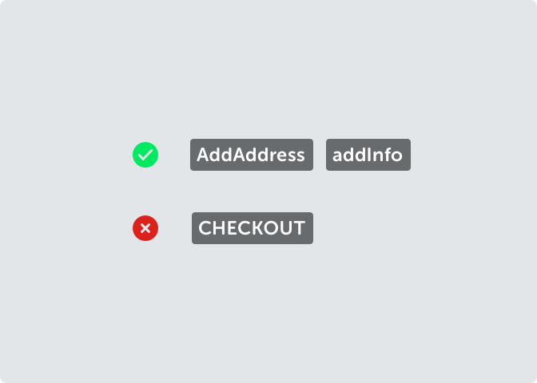

<text-primary>

Badges are used for elements that need to be labeled or categorized. It consists of a keyword that helps to draw attention.

</text-primary>

## Style

The badge in Kata Platform is distinguished by category of what features is in used and it has different styles.

## Anatomy

The badge in Kata Platform is distinguished by category of what features is in used and it has different styles.

1. Text badge
2. Container

## Specs

## Best Practices

<md-row class="component-guide">
<md-col class="component-guide-image">

</md-col>
<md-col class="component-guide-content">

<guideline-table title="Do">
  <guideline-ul>
    <guideline-li guide="do">The distance between elements is 8 pixels</guideline-li>
  </guideline-ul>
</guideline-table>

<guideline-table title="Don't">
  <guideline-ul>
    <guideline-li guide="dont">Don't make a distance of more than 8 pixels</guideline-li>
  </guideline-ul>
</guideline-table>

</md-col>
</md-row>

<md-row class="component-guide">
<md-col class="component-guide-image">

</md-col>
<md-col class="component-guide-content">

<guideline-table title="Do">
  <guideline-ul>
    <guideline-li guide="do">Use type style body small bold for the text on badge</guideline-li>
    <guideline-li guide="do">Use padding between text and container according to specs</guideline-li>
  </guideline-ul>
</guideline-table>

<guideline-table title="Don't">
  <guideline-ul>
    <guideline-li guide="dont">Don't make a distance of more than 8 pixels</guideline-li>
  </guideline-ul>
</guideline-table>

</md-col>
</md-row>

<md-row class="component-guide">
<md-col class="component-guide-image">

</md-col>
<md-col class="component-guide-content">

<guideline-table title="Do">
  <guideline-ul>
    <guideline-li guide="do">Use Pascal Case or Camel Case for text on badge</guideline-li>
  </guideline-ul>
</guideline-table>

<guideline-table title="Don't">
  <guideline-ul>
    <guideline-li guide="dont">Don't make uppercase</guideline-li>
  </guideline-ul>
</guideline-table>

</md-col>
</md-row>
