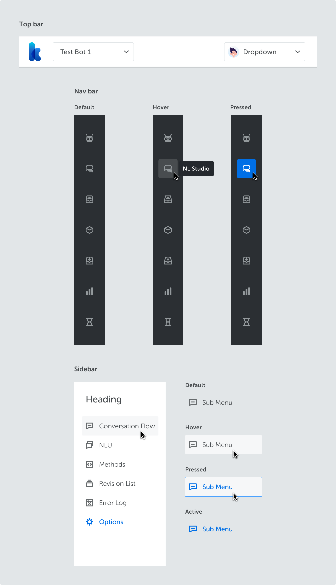

<text-primary>

Use tooltips to display brief & helpful information to an element.

</text-primary>

## Style

### Top bar

Top bar provides information & options about the current page. Options on top bar can be selected using dropdown menu.

### Nav bar

Nav bar is used to display main features, which are represented with an icon. A tooltip will appear if users hover their pointer above the icon.

### Sidebar

Sidebar will show a list of options related to the selected feature on nav bar.
