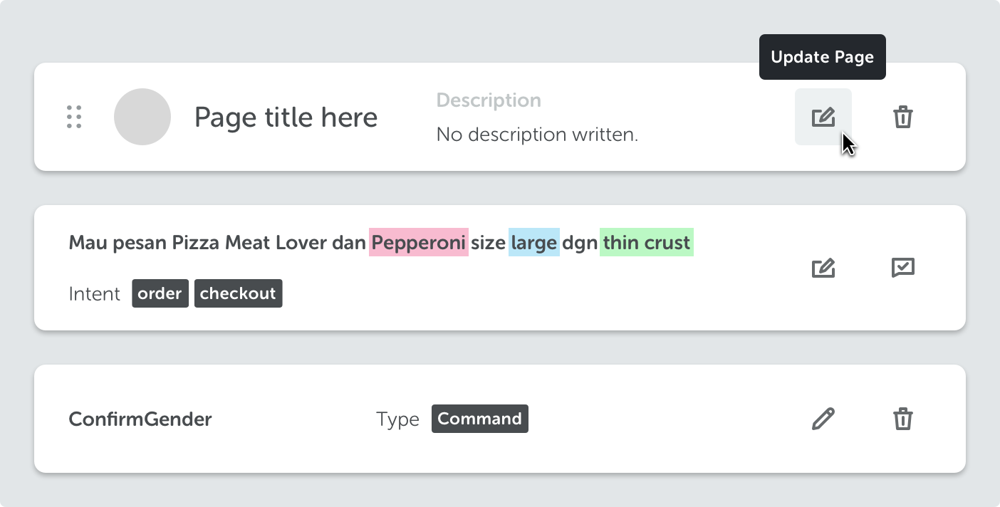

<text-primary>

Use brick to display content and options about one subject in an individual container. Available options on bricks are represented with icons, which will show tooltip on hover.

</text-primary>

