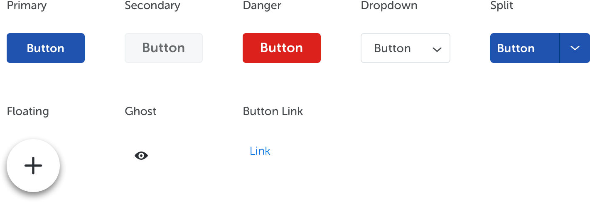
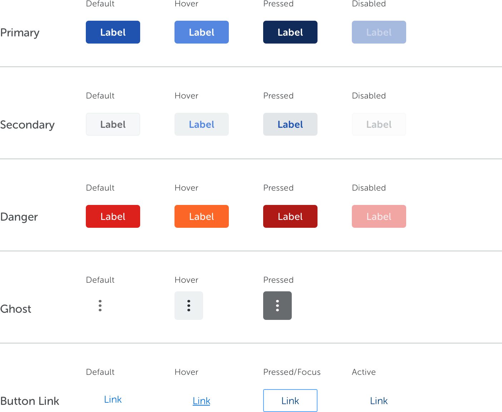

<text-primary>

Button allows users to trigger an action or make choices.

</text-primary>

## Style

Button styles vary according to their purpose & context.

### Button Size

Vestibulum rutrum quam vitae fringilla tincidunt. Suspendisse nec tortor urna. Ut laoreet sodales.

### Button Shape

Vestibulum rutrum quam vitae fringilla tincidunt. Suspendisse nec tortor urna. Ut laoreet sodales.

### Button State

Vestibulum rutrum quam vitae fringilla tincidunt. Suspendisse nec tortor urna. Ut laoreet sodales.

### Button Type

Vestibulum rutrum quam vitae fringilla tincidunt. Suspendisse nec tortor urna. Ut laoreet sodales.

