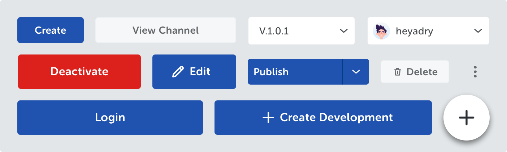
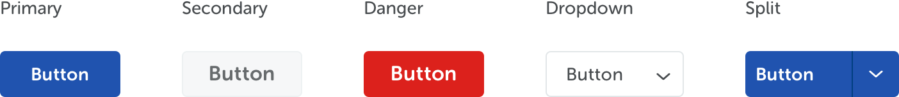
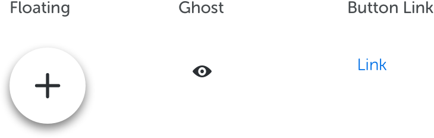
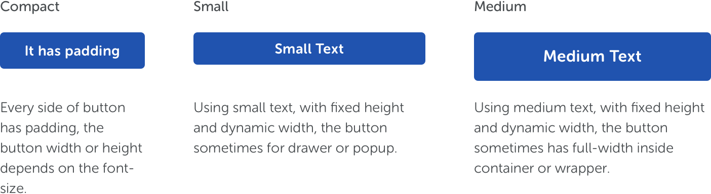
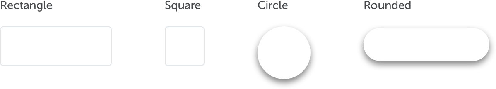
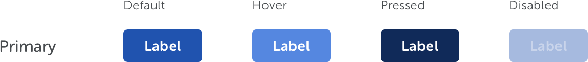
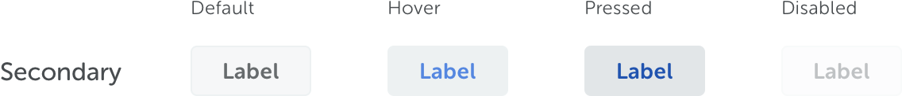
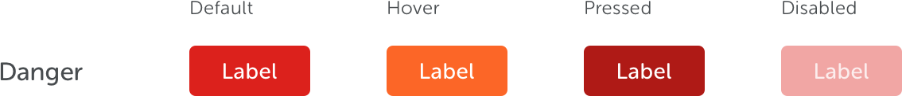
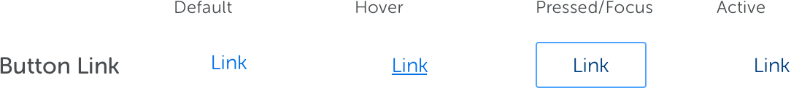
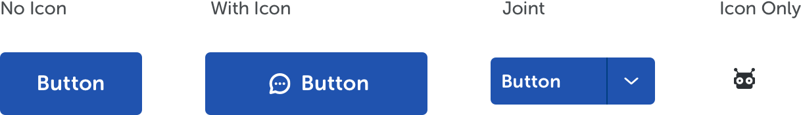

<text-primary>

Use brick to display content and options about one subject in an individual container. Available options on bricks are represented with icons, which will show tooltip on hover.

</text-primary>

## Style

Different styles of button serves different purposes.

### Button Size

### Button Shape

### Button State

### Button Type

Vestibulum rutrum quam vitae fringilla tincidunt. Suspendisse nec tortor urna. Ut laoreet sodales.

