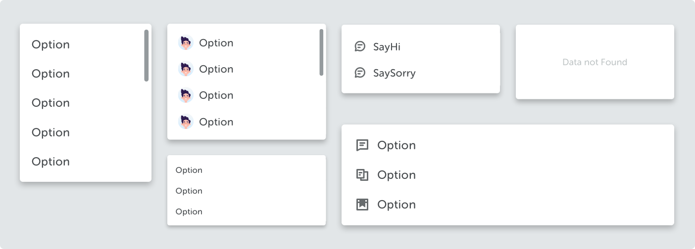
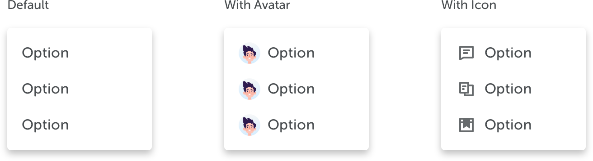
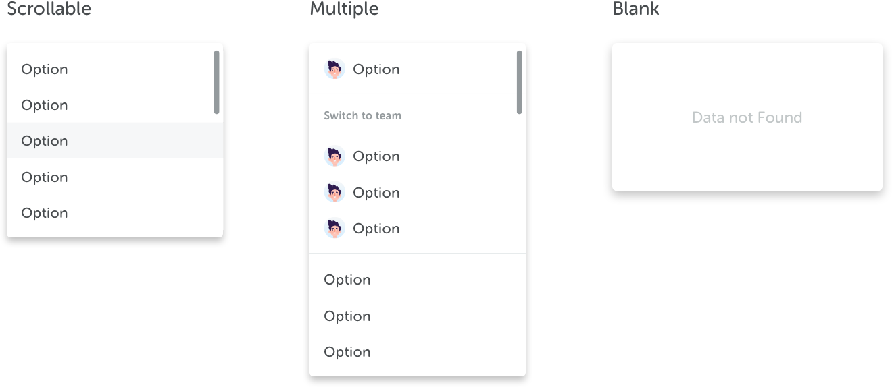

<text-primary>

Dropdown is used to show a list of options that users can select. It delivers options to choose.

</text-primary>

## Style

Different styles of dropdown serves different purposes.

### Type

Lorem ipsum dolor sit amet, consectetur adipiscing.

