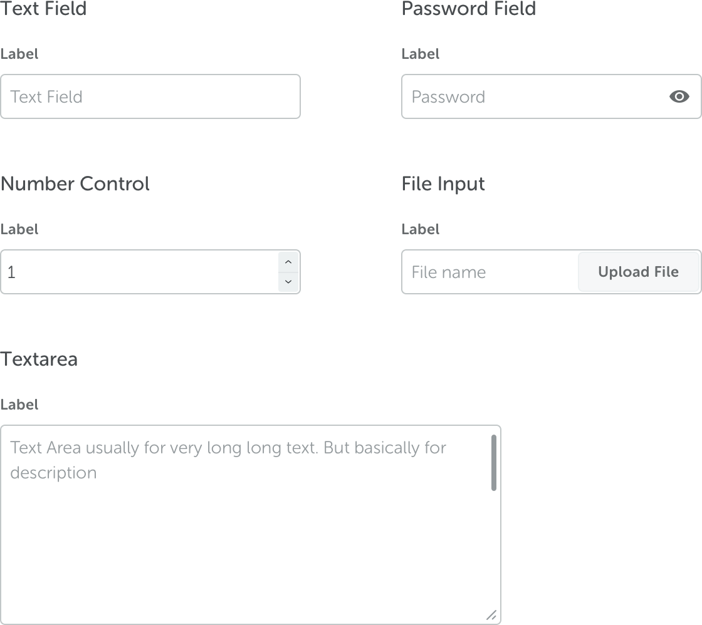
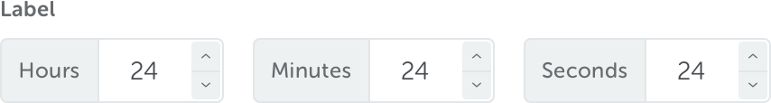
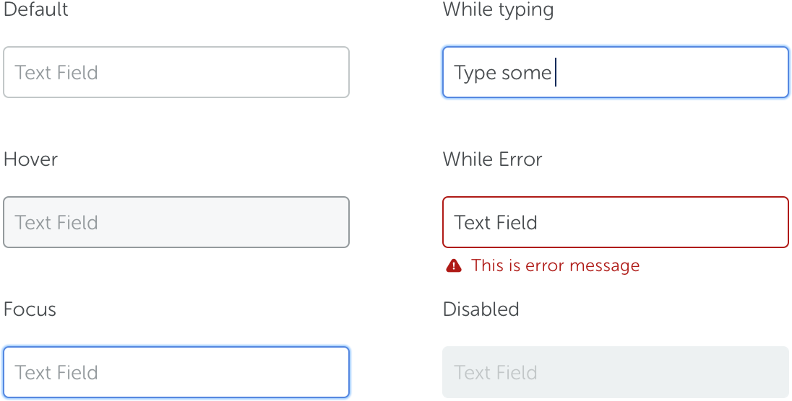

<text-primary>

Input fields allow users to enter or edit text. Their usage, style, and behavior depend on the context.

</text-primary>

## Style

Different styles of input field serves different purposes.

### Time field

<md-row class="component-guide">
<md-col class="component-guide-image" md="8">

</md-col>
</md-row>

## State

Input field has 6 types of states.

