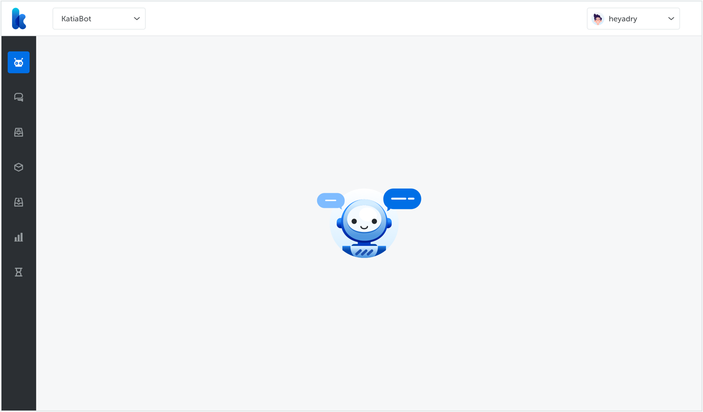
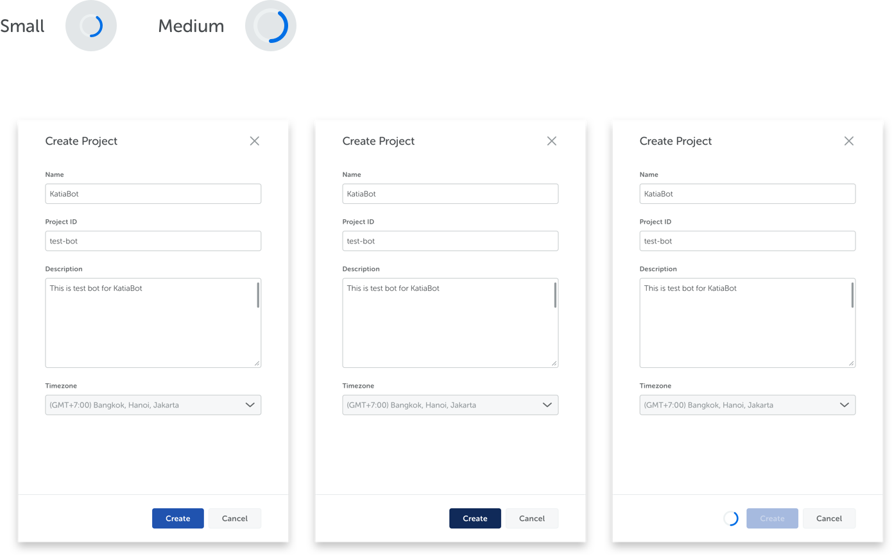
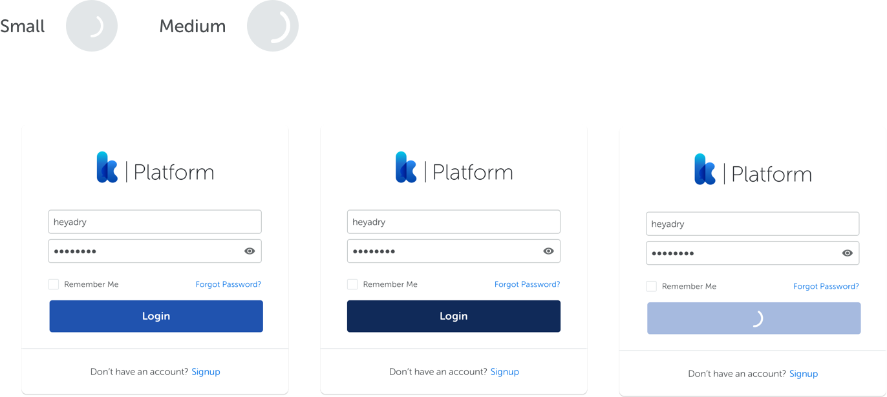

<text-primary>

Loader animation appears while the content of a page is being loaded.

</text-primary>

## Style

Different styles of Loader serves different purposes.

### Page Loader

Use blue spinner on white background, such as form. Place it on the side of a button.

### Blue Spinner

Use blue spinner on white background, such as form. Place it on the side of a button.

### Light Spinner

Use light spinner for areas with minimal space. When the user clicks the button, replace the text with the light spinner and place it in the center.

