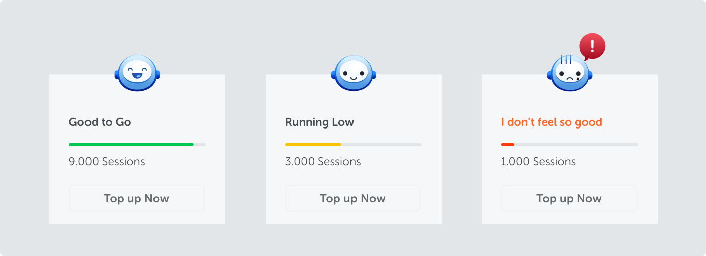
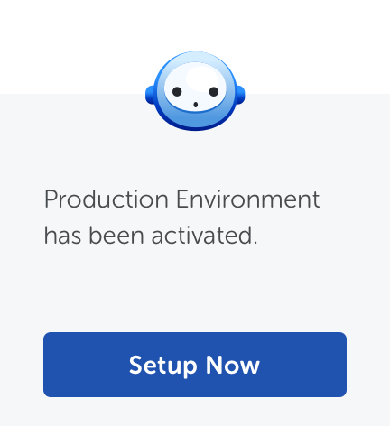
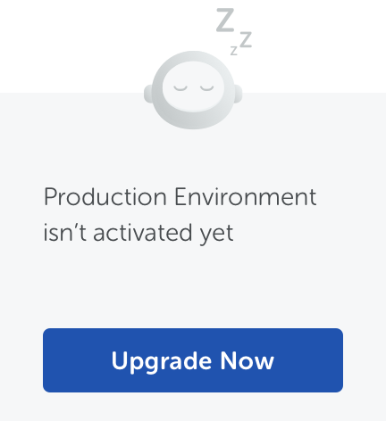
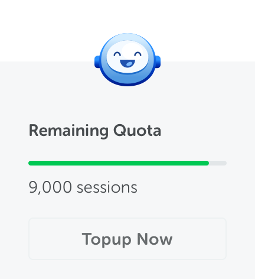
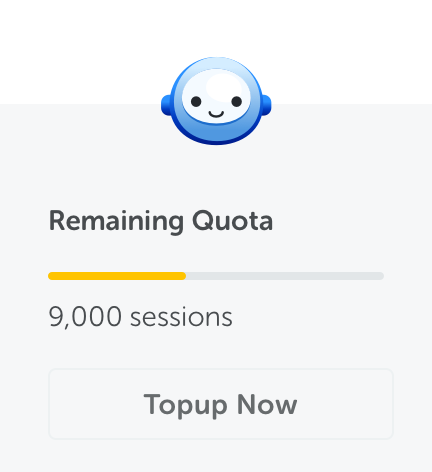
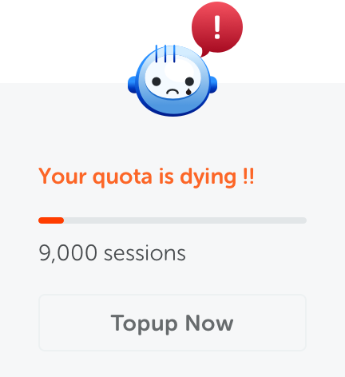

<text-primary>

Use meter to help users monitor and track the usage of a specific feature in real-time.

</text-primary>

## Style

Different styles of meter serves different purposes.

<md-row class="component-guide">
<md-col class="component-guide-image" md="4">

**Before-activated Box Meter**

</md-col>
<md-col class="component-guide-image" md="4">

**Before-setup Box Meter**

</md-col>
</md-row>

### Activated Box Meter

<md-row class="component-guide">
<md-col class="component-guide-image" md="4">

High Status

</md-col>
<md-col class="component-guide-image" md="4">

Middle Status

</md-col>
<md-col class="component-guide-image" md="4">

Lower Status

</md-col>
</md-row>
