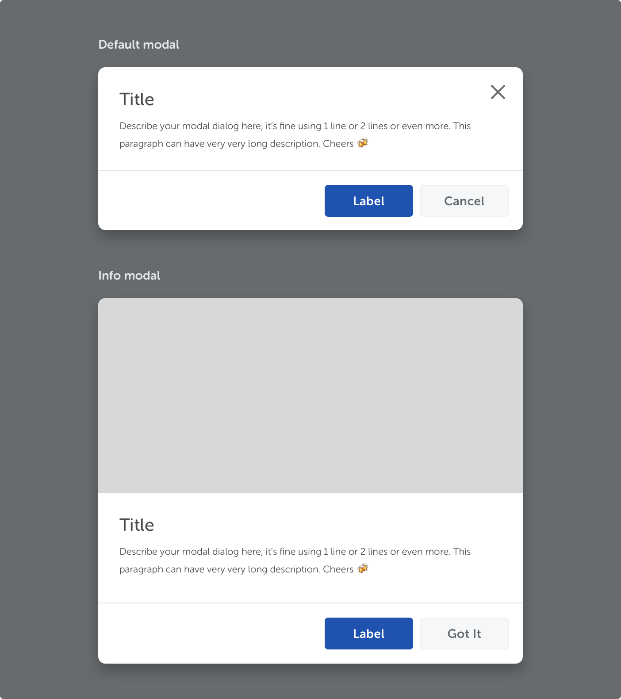

<text-primary>

Modals are used to inform users about critical information, to get feedback from a user, or to show relevant information about a page.

</text-primary>

## Style

### Default modal

Default modals are initiated by user actions such as clicking a button, following a link or selecting an option.

### Info modal

Use info modal to introduce a page or to make an announcement.
