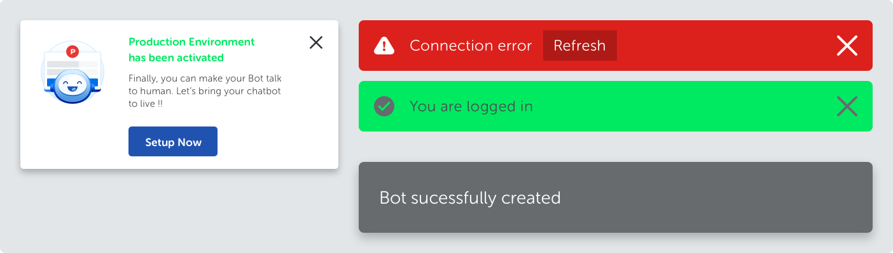
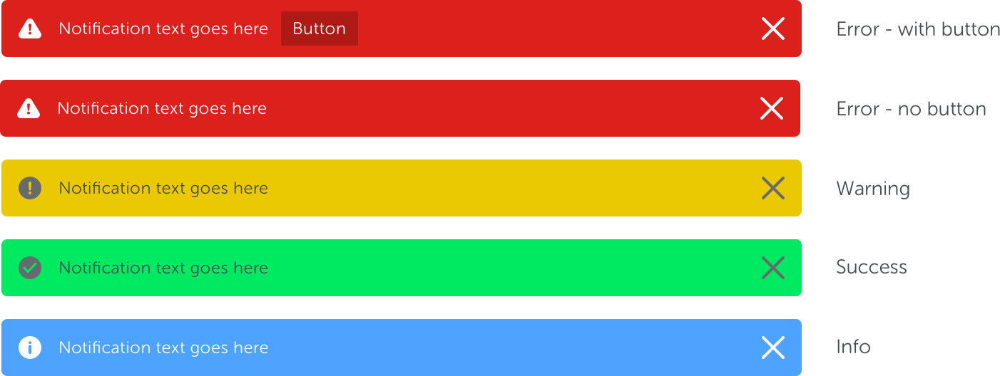
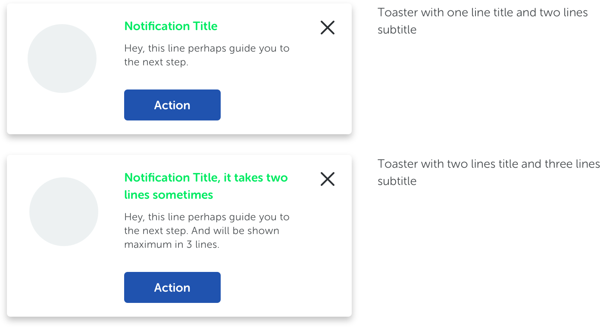
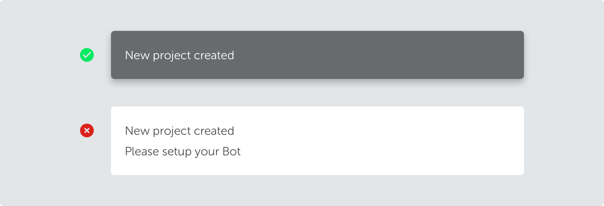

<text-primary>

Notifications provide short, timely, and relevant information about user activity while using the platform.

</text-primary>

## Style

Notifications are intended to inform users about events. These three types of notifications that are made is has to be straightforward, helpful, write in first-person, and appropriate.

### Banner

Banner communicates specific information to a user. Update users about a change or give them advice. It displayed at the top or inside the section.

### Toaster

Toaster has a relative min-height and fixed width depending on the content. A toaster cannot grow more than 2 lines for notification title and 3 lines for subtitle text.

### Flag

Convey general information or actions that aren’t critical. Include lower priority information and automatically dissapear after specific second.

[TODO: flag]

## Best practices

### Banner

<md-row class="component-guide">
<md-col class="component-guide-content">
<guideline-table title="Do">
  <guideline-ul>
    <guideline-li guide="do">Use color combinations that meet accessibility guidelines (minimum AA rating)</guideline-li>
    <guideline-li guide="do">If there’s a actionable link, use button style and ensure background color darker than banner color</guideline-li>
  </guideline-ul>
</guideline-table>
</md-col>
<md-col class="component-guide-content">
<guideline-table title="Don't">
  <guideline-ul>
    <guideline-li guide="dont">Don't use colors with poor accesibility rating</guideline-li>
    <guideline-li guide="dont">Don't use link style for actionable link</guideline-li>
  </guideline-ul>
</guideline-table>
</md-col>
</md-row>

### Toaster

<md-row class="component-guide">
<md-col class="component-guide-content">
<guideline-table title="Do">
  <guideline-ul>
    <guideline-li guide="do">If notification title has 1 line, so as subtitle has max. 2 lines</guideline-li>
    <guideline-li guide="do">If notification title has 2 line, so as subtitle has max. 3 lines</guideline-li>
    <guideline-li guide="do">Notification title and subtitle has to be left-aligned</guideline-li>
    <guideline-li guide="do">Relative min-height in order to adapt the lines and max. width within 400px</guideline-li>
  </guideline-ul>
</guideline-table>
</md-col>
<md-col class="component-guide-content">
<guideline-table title="Don't">
  <guideline-ul>
    <guideline-li guide="dont">Do not use colors other than green for notification title</guideline-li>
    <guideline-li guide="dont">Do not use colors other than dark for subtitle text</guideline-li>
    <guideline-li guide="dont">Do not apply link style for CTA</guideline-li>
  </guideline-ul>
</guideline-table>
</md-col>
</md-row>

### Flag

<md-row class="component-guide">
<md-col class="component-guide-content">
<guideline-table title="Do">
  <guideline-ul>
    <guideline-li guide="do">Use warm dark background</guideline-li>
    <guideline-li guide="do">Use 1 line notification text, and light color</guideline-li>
    <guideline-li guide="do">Appeared at bottom center of the screen, and dismissed after 5 seconds</guideline-li>
  </guideline-ul>
</guideline-table>
</md-col>
<md-col class="component-guide-content">
<guideline-table title="Don't">
  <guideline-ul>
    <guideline-li guide="dont">Don't use flat shape box, and light background</guideline-li>
    <guideline-li guide="dont">Don't use 2 lines notification text</guideline-li>
    <guideline-li guide="dont">Don't put button, link, nor close</guideline-li>
  </guideline-ul>
</guideline-table>
</md-col>
</md-row>
