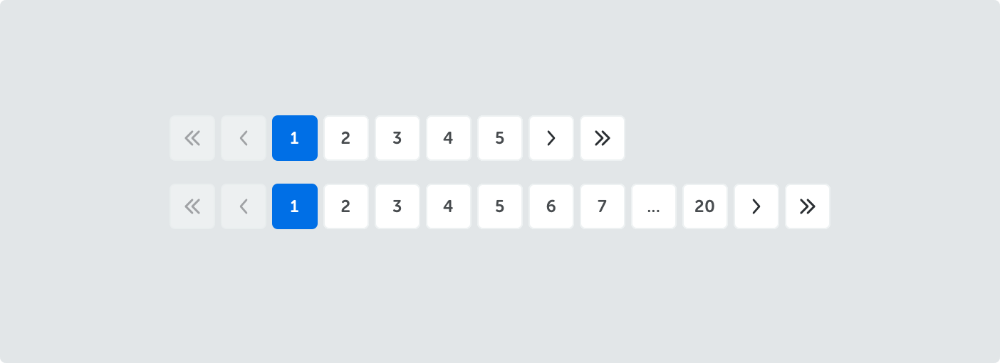
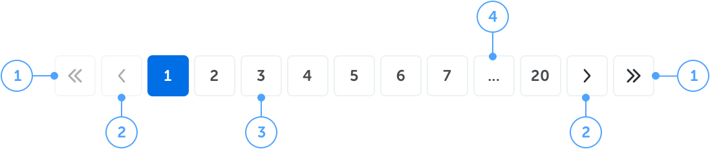
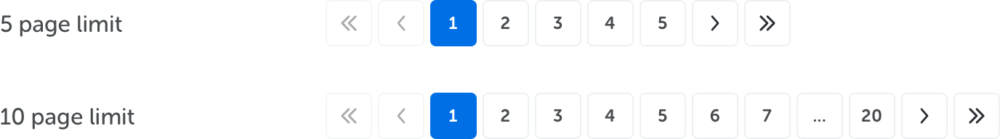
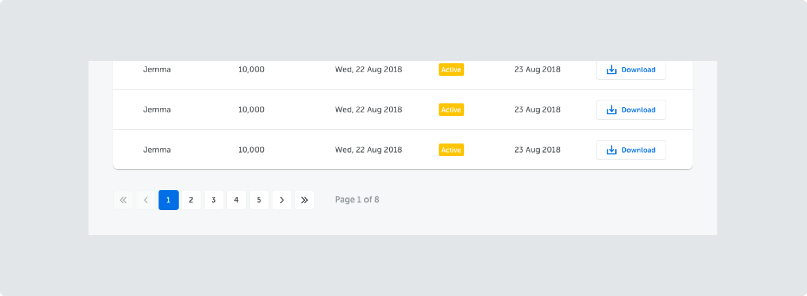
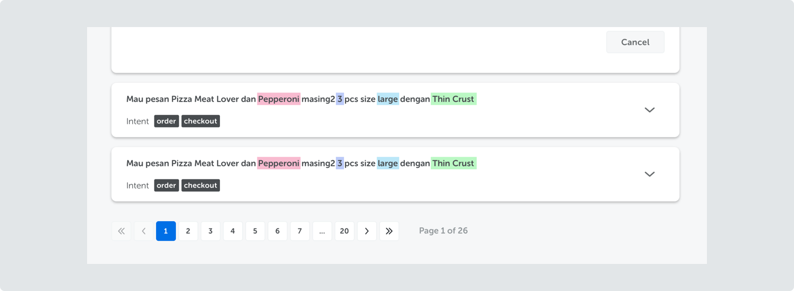
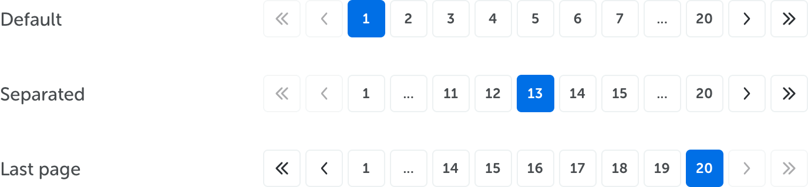
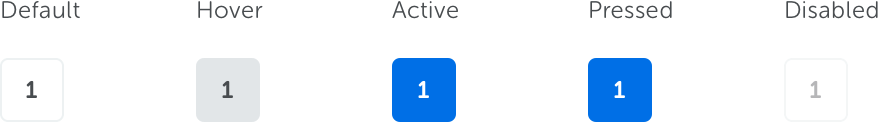

<text-primary>

Pagination is used to help users navigate across multiple pages.

</text-primary>

## Details

<md-row class="component-guide" justify="centered">
<md-col class="component-guide-content" md="10">

</md-col>
</md-row>

1. **Very first & Very Last** 
   Go to the first page or the last page.
2. **Prev & Next** 
   Go to the previous or the next page from the current page.
3. **Page Navigation** 
   Go to the selected page number.
4. **Truncation** 
   Ellipsis appears when there are more than seven pages available. Clicking the ellipsis will show the next seven or the remaining page(s).

## Style

Paginations come in two different styles.

## Behavior

The position of the currently selected page will affect the behavior of pagination.

## State

<md-row class="component-guide">
<md-col class="component-guide-content" md="8">

</md-col>
</md-row>
