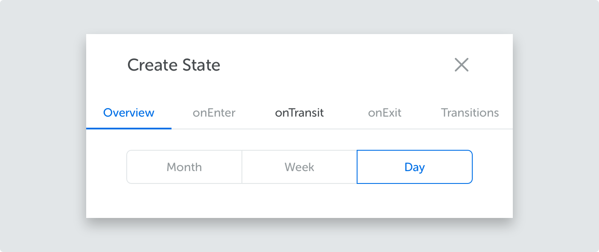
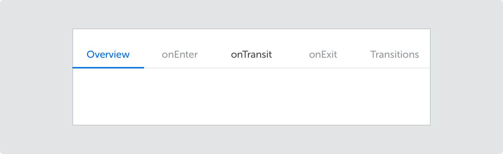
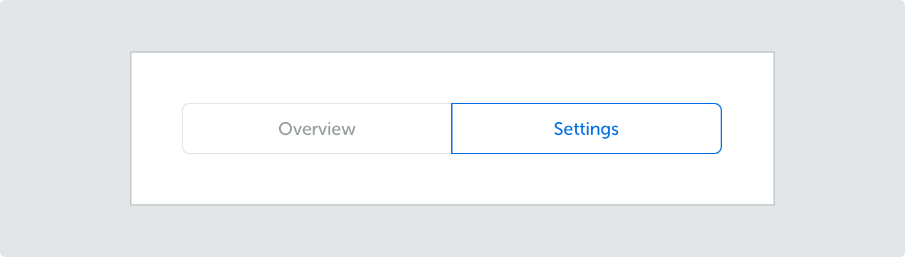

<text-primary>

Tabs let users to quickly navigate between contents within the same page.

</text-primary>

## Style

### Line tabs

Line tabs are exclusively used in drawer. If you want to use line tabs & pill tabs in the same page, use line tabs as the primary tab.

### Pill tabs

There is no particular rules in using pill tabs. Use it wherever you see fit.

