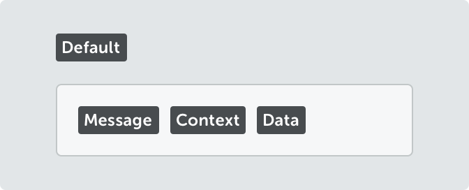
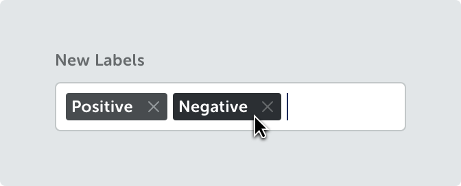

<text-primary>

Tags are used to label, categorize, and organize data.

</text-primary>

## Style

<md-row class="component-guide">
<md-col class="component-guide-image">

</md-col>
<md-col class="component-guide-content">

### Default tag

On default, tags are static and only used as a visual label.

</md-col>
</md-row>

<md-row class="component-guide">
<md-col class="component-guide-image">

</md-col>
<md-col class="component-guide-content">

### Removable tag

Remove sign is always shown on the right side of the text.

</md-col>
</md-row>

<md-row class="component-guide">
<md-col class="component-guide-image">

</md-col>
<md-col class="component-guide-content">

### Icon tag

Icon is always shown on the left side of the text.

</md-col>
</md-row>
