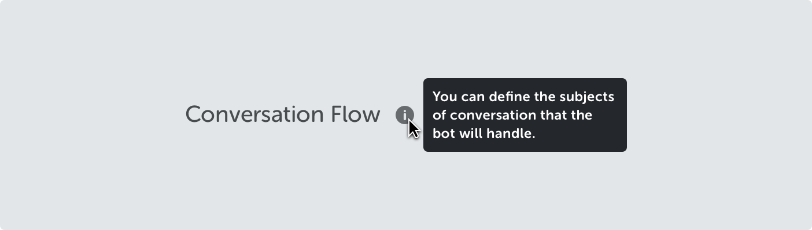
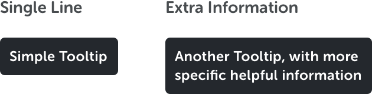
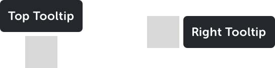
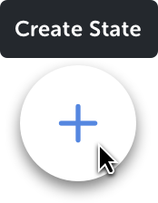

<text-primary>

Use tooltips to display brief & helpful information to an element.

</text-primary>

## Size

<md-row class="component-guide">
<md-col class="component-guide-image">

</md-col>
<md-col class="component-guide-content">

Different sizes are used depending on the length of information.

</md-col>
</md-row>

<md-row class="component-guide">
<md-col class="component-guide-image">

</md-col>
<md-col class="component-guide-content">

Tooltips are displayed when user hover the pointer over an element. It will show up on either top or right side of an element.

</md-col>
</md-row>

## Sample

<md-row class="component-guide">
<md-col class="component-guide-image" md="2">

</md-col>
</md-row>

**Create State (floating button)** \
Display tooltip at the top of an icon.

<md-row>
<md-col class="component-guide-image" md="7">

</md-col>
</md-row>

**Conversation Flow (page title)** \
When it is used to explain features, display the information on the right side of the element.
