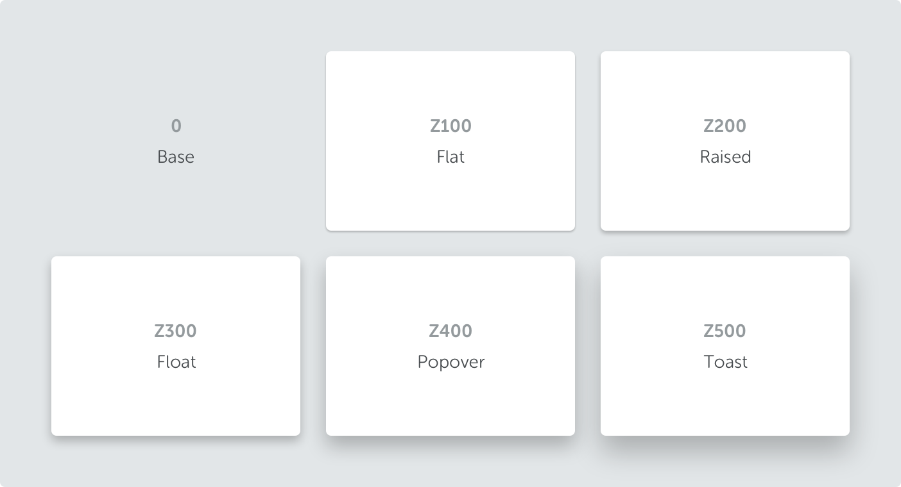

<text-primary>

The elevation is the level of the surface position where the content and components are located. The elevation is based on the Z-Index and this is the principle to classified between components with focus hierarchy through depth.

</text-primary>

| Name    | Elevation | z-index | box-shadow                     | Use on                                                                           |
| ------- | --------- | ------- | ------------------------------ | -------------------------------------------------------------------------------- |
| Base    | 0         | 0       | none                           | Base screen                                                                      |
| Flat    | 1         | Z100    | 0 1px 2px 0 rgba(0,0,0,0.25)   | Card, and Bricks components in default state                                     |
| Raised  | 2         | Z200    | 0 2px 4px 0 rgba(0,0,0,0.25)   | Card, and Bricks components in hover state                                       |
| Float   | 4         | Z300    | 0 4px 8px 0 rgba(0,0,0,0.25)   | Floating action button, Select, Dropdown, Date range, and Date select components |
| Popover | 8         | Z400    | 0 8px 16px 0 rgba(0,0,0,0.25)  | Modal, and Drawer components                                                     |
| Toast   | 12        | Z500    | 0 12px 24px 0 rgba(0,0,0,0.25) | Toaster components                                                               |
