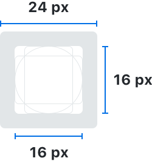
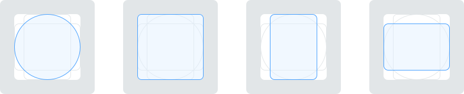
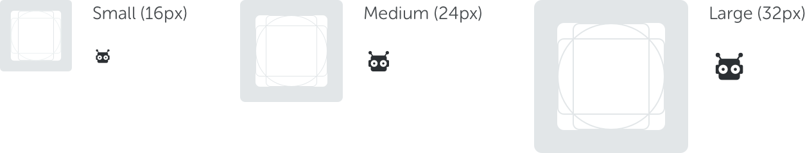
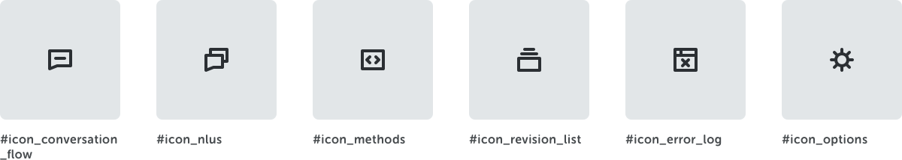
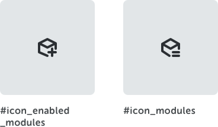
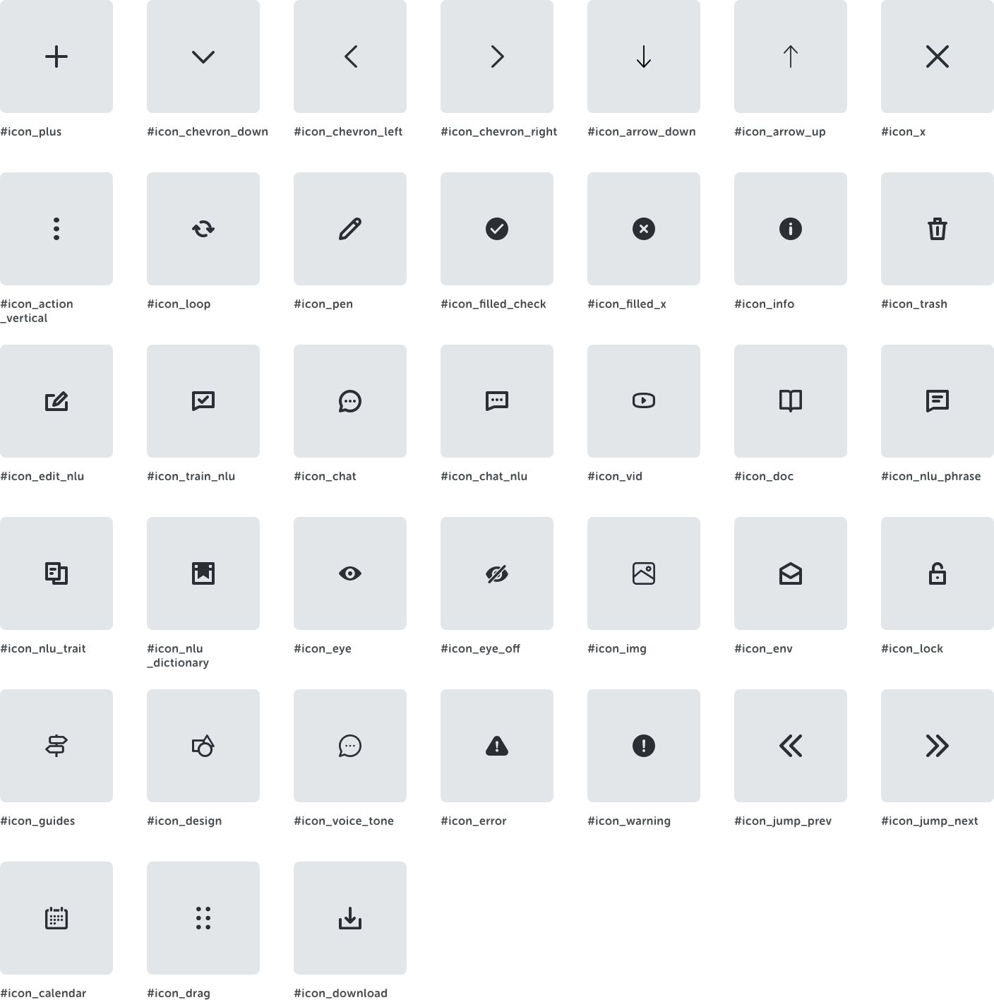

<text-primary>

Iconography uses symbols to represent meaning in visually. They communicate a message and should be distinct and informative. Icons should be simple, yet clear enough to grab attention.

</text-primary>

## Icon Grid

Regular icons are designed on a 16px grid and exported on a 24px artboard. While preparing the artboard, it's important to align elements to the pixel grid to ensure pixel-perfect icons.

## Icon Shape

Create icons on the grid using basic foundational shapes. These include circle, square and rectangles (horizontal and vertical). Sticking to these shapes in the grid keeps consistent proportions throughout the icon set.

## Icon Size

Icons are auto-scaled to provide four additional sizes: small (16px), medium (24px), large (32px).

## Icon Set

### UI High-level Icons

### UI Mid-level Icons

#### 1. Bot Studio

#### 2. NL Studio

<md-row class="principle">
<md-col md="10" class="principle-image">

</md-col>
</md-row>

#### 3. CMS

<md-row class="principle">
<md-col md="8" class="principle-image">

</md-col>
</md-row>

#### 4. Module

<md-row class="principle">
<md-col md="4" class="principle-image">

</md-col>
</md-row>

#### 5. Deploy

<md-row class="principle">
<md-col md="4" class="principle-image">

</md-col>
</md-row>

#### 6. Analytics

<md-row class="principle">
<md-col md="6" class="principle-image">

</md-col>
</md-row>

#### 7. Usage

<md-row class="principle">
<md-col md="4" class="principle-image">

</md-col>
</md-row>

### Core Icons

