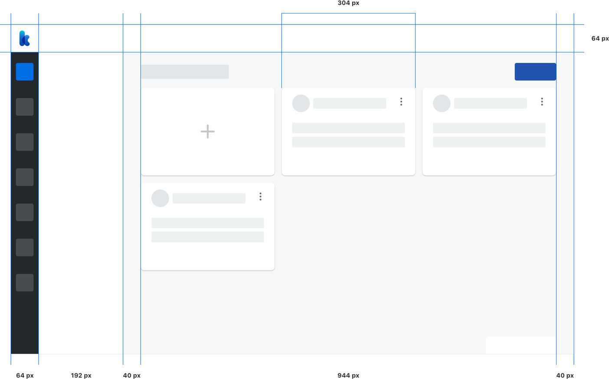

<text-primary>

The principal use of an 8px grid in layout foundation provides robust design and consistently positioning elements on screen. With consistent layout will bring the best experience to users to understanding the contexts for all pages in Kata Platform.

</text-primary>

## Base

Kata Platform start the layout from desktop screen 1280px. To create the best user experience in using the Kata Platform, we provide the breakpoints from 1024px until 1600px up.

**1280px (enable to 1439px)**
