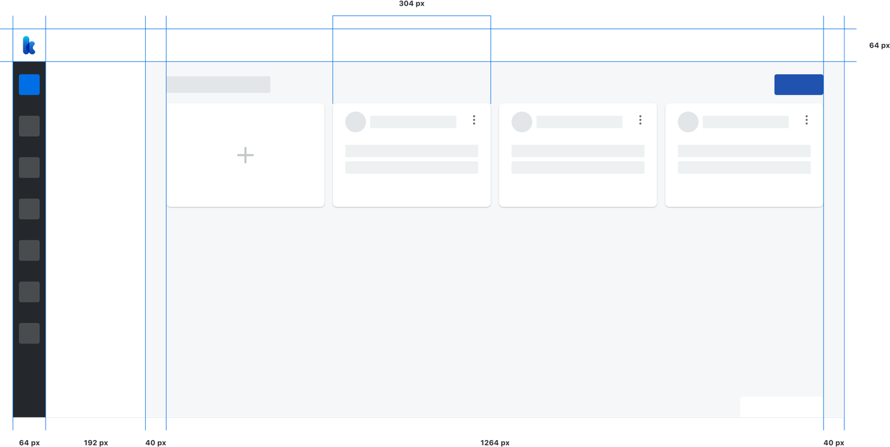
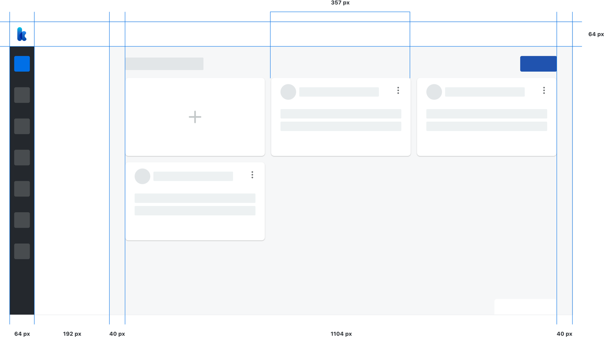
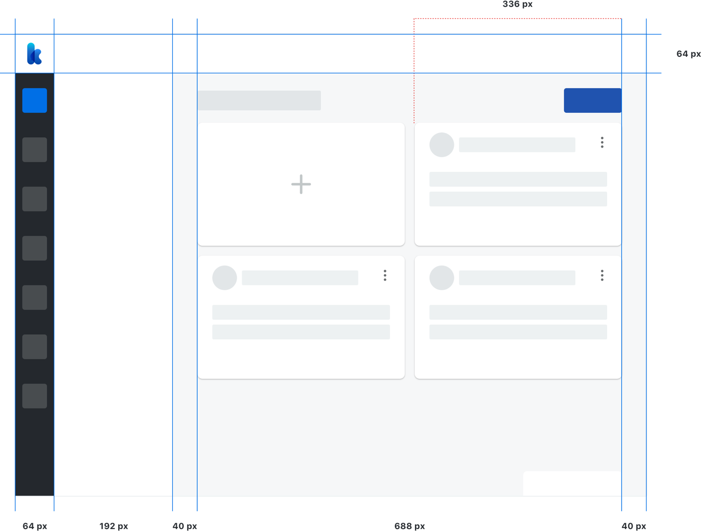
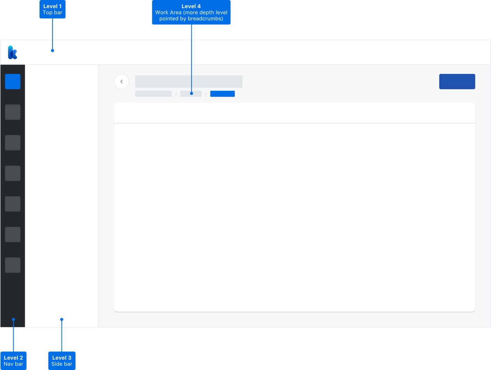

<text-primary>

The principal use of an 8px grid in layout foundation provides robust design and consistently positioning elements on screen. With consistent layout will bring the best experience to users to understanding the contexts for all pages in Kata Platform.

</text-primary>

## Base

Kata Platform start the layout from desktop screen 1280px. To create the best user experience in using the Kata Platform, we provide the breakpoints from 1024px until 1600px up.

### 1280px (enable to 1439px)

## Breakpoints

### 1600px (and more)

### 1440px (enable to 1599px)

### 1024px (enable to 1279px)

## Hierarchy

Kata Platform is known well as a sophisticated AI Platform. Every component that arranges is bold and robust. Every component harmoniously set in the clear hierarchy from top bar, nav bar, sidebar into the work area. It will create the best experience for users to use it.

## Levels

### Level 1 (top bar)

In the top bar, users can access the Project and Account features.

### Level 2 (nav bar)

In the nav bar, users can access all feature menu inside the Project.

### Level 3 (side bar)

In the nav bar, users can access all sub menu feature inside the menu from Project.

### Level 4 and more (work area)

In the work area, users can work and perform the actions on the submenu feature. The work area has a depth level that is pointed by using breadcrumbs.
